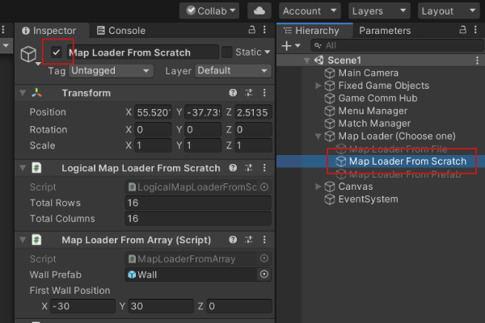
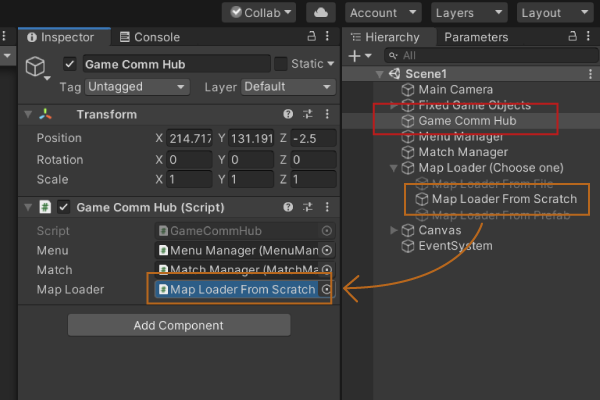

# Top Down Game

This test game was created for general practicing purposes:
* Mainly development via the component/composition pattern, going hand in hand with the SOLID principles. 
    - More specifically, the Single Responsibility Principle is applied by making each component/class responsible for a single game functionality.
    - Additionally, the Interface Segregation Principle is applied from the component perspective; There isn't a general purpose component. Instead, each GameObject's functionality is defined by attaching several components/scripts.
* The main pilars of OOP are also used; Inheritance, Polymorphism and Encapsulation, going hand in hand again with the SOLID principles
	- Here, the Open Closed Principle is applied on the MapLoader and LogicalMapLoader abstract classes and all of the classes that inherit from them.
	- Also, the Liskov Substitution Principle is used for map loading.
* I used XML code documentation as well, in order to generate a doc, available on /Top Down Game 1/Docs/html/index.html.

## Game Features
* The goal of the game is to collect every item on each map, avoiding the enemies.
* Controls: WASD to move.
* Menu
* Map Generation

## Map Generation
There are 3 different ways of creating the match maps:
1. From scratch, using a simple algorithm that places random walls on the map.
2. From a .txt file.
3. From prefabs.

The composition pattern allows to quickly change between each map loading approach on two steps:

1. On the Hierarchy, on the "Map Loader" GameObject enable only the GameObject of the desired loading approach.

2. On the "Game Comm Hub" GameObject, drag the chosen map loader GameObject to the "Map Loader" field, on the "GameCommHub" script.

## Character Movement

The characters' movement is also easily changed through composition. The enemies or items can be controlled like the hero and the hero can move like the NPCs.

## Docs

The code documentation is available on the Docs folder (/Top Down Game 1/Docs/html/index.html)
